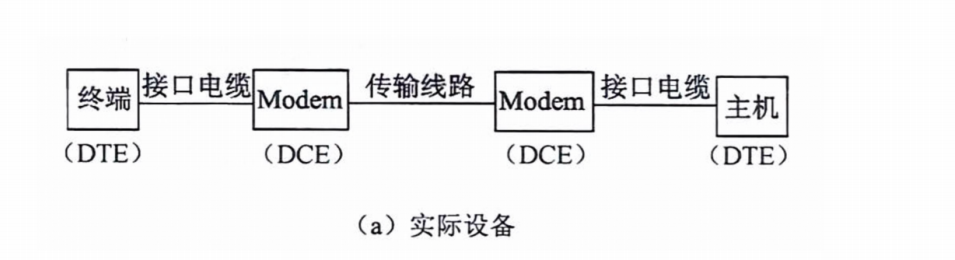

# 广域通信网

## 广域网物理层特性

> 公共交换电话网 PSTN

- 在公共交换电话网（Public Switched Telephone Network）是为了语音通信而建立的网络，从20实际60年代开始又被用于数据传输。
- 电话网有三个部分组成：本地回、干线和交换机
- 干线和交换机一般采用数字传输技术和交换技术，而本地回路基本采用模拟线路
- 电话线联网是需要在发送端通过调制解调器把数字信号转换成模拟信号，接收端再通过调制解调器把模拟信号变换为数字信号。

> 本地回路

- DTE（Data Terminal Equipment）数据终端设备，这种设备代表通信链路的端点。
- DCE（Data Circuit Equipment）数据电路设备，用于信号变换器、自动呼叫等。
- DTE：PC/电话机
- DCE：猫/调制解调器/Modem

> 机械特性

- 下面一RS-232-C接口为例说明描述设备之间通信有关的技术特性。
- 机械特性描述DTE和DCE之间物理上的分界线，规定连机器的集合形状、尺寸大小、引线数、引线排列方式及锁定装置等。
- RS-232-C没有正式规定连机器的标准，只有在其附录中建议使用25针的D型连接器，也有很多使用其他连接器，特别是在微型机RS-232-C串行接口上，大多数使用9针连接器

> 电器特性

- RS-232-C采用的V.28标准电路，速率20kb/s，最长15米。
- 信号源产生3-15V的信号，-3V~+3V之间是信号电平过渡区。
- 3-15V表示1，-3V-15V表示0

> 例题
>
> 
>
> 

## 流量和差错控制

流量控制：协调发送站和接收站工作步调，避免发送速度过快，接收站处理不过来。X.25 TCP

差错控制：检测和纠正传输错误的机制。检错码：CRC，纠错码：海明码

